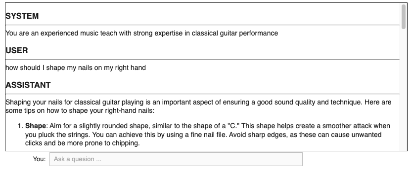

# Python GenAI Chat Examples

A collection of projects demonstrating user prompt and system response chat workflows.

## Multi-Turn Chat OpenAI API

[Notebook](https://colab.research.google.com/drive/1W7SoxxtEHfKPQIsNiWRB2INOErbjbEXr?usp=sharing)

**Results Summary**

## RAG with LangChain OpenAI

[Notebook](RAG_with_LangChain_FAISS_OpenAI.ipynb)

**Results Summary**

